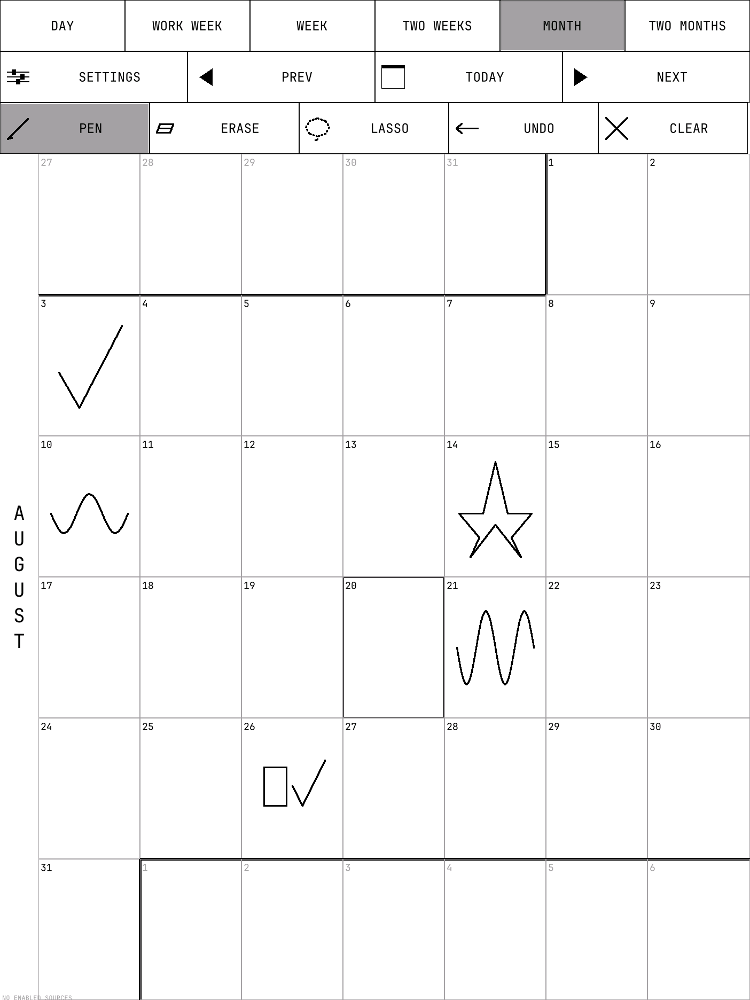
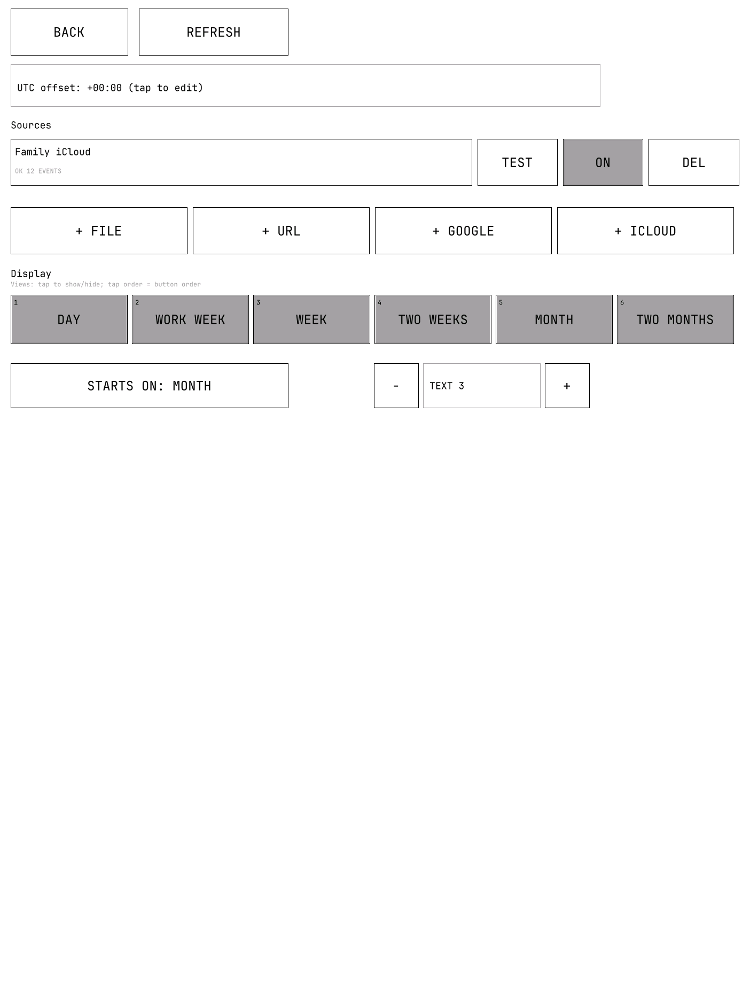

# remarkable-calendar-notes

A read-only calendar app for the **reMarkable 2**, with persistent
handwritten notes attached to individual dates. Runs as an [AppLoad](https://github.com/asivery/rm-appload)
external QTFB app — no jailbreak/takeover mode required.

| Month view (with handwritten notes) | Settings menu |
| --- | --- |
| [](docs/screenshots/month.png) | [](docs/screenshots/settings.png) |

- **Views:** Day, Work Week, Week, Two Weeks, Month, and Two Months, with
  compact, handwriting-friendly grids and `PREV`/`TODAY`/`NEXT`
  navigation; `TODAY` always jumps to the real current date at your
  configured UTC offset. In Settings you choose **which views appear and in
  what order**, and **which view the app opens on**. Every view except Two
  Months uses the same day-cell aspect ratio, so a note keeps its shape as
  you switch views. Both a finger and the pen operate the toolbar buttons;
  a finger tap on a cell opens that day, while resting your palm to write
  is ignored (palm rejection).
- **Notes:** write on any date in any view with the pen; notes are stored
  normalized to that date's grid cell, so the same handwriting renders
  in every view and survives navigation/restart.
  Use **PEN**, stroke **ERASE** (with a faint eraser trail), or **LASSO**
  (a dashed grey outline) deletion. Each pen sample draws only its newest
  stroke segment and refreshes only the few pixels it touched; the event
  loop polls the pen aggressively and batches display updates so fast
  strokes keep their shape. **UNDO** reverses your last edit — including an
  erase or lasso — and clear-day is included.
- **Calendar sources**, all configured in-app (no config files to hand
  edit): a local `.ics` file, an arbitrary HTTPS `.ics` URL, Google
  Calendar (OAuth device flow, with an in-app `LOG IN` action), and iCloud
  (CalDAV + app-specific password). Fetching runs on a worker thread, so
  the UI stays responsive; each source caches its last successful fetch
  offline and shows its own status/errors without taking down the rest of
  the app.
- **ICS parsing** handles folded lines, text escaping, `DATE`/`DATE-TIME`
  values, and `RRULE` recurrence (`DAILY`/`WEEKLY`/`MONTHLY`/`YEARLY`,
  `INTERVAL`, `COUNT`, `UNTIL`, `BYDAY`) over a bounded display window.

Requires reMarkable OS **3.26–3.27.x** (see
[docs/FIRMWARE_COMPATIBILITY.md](docs/FIRMWARE_COMPATIBILITY.md)).

## Install

The current install is manual because the app is not in Vellum's package
feed. Releases offer two choices: the standard AppLoad bundle, or an
**OS 3.27-only XOVI sidebar bundle** that also adds a Calendar Notes icon
to xochitl's normal sidebar. In short:

1. Connect the rM2 by USB and SSH to `root@10.11.99.1`.
2. Install Vellum, then run `vellum add appload tripletap` and
   `xovi/rebuild_hashtable`.
3. Download the single `remarkable-calendar-notes-<version>.zip` (and its
   `.sha256`) from the public
   [main repository releases](https://github.com/astafan8/remarkable-calendar-notes/releases).
   It contains the app, the optional sidebar, and the installers.
4. Extract the zip on the computer, then install the app with one SSH
   password prompt (the installer lives in the `diagnostics/` folder):

   ```powershell
   .\install-device.ps1 -Bundle .\remarkable-calendar-notes-<version>.zip
   ```

   The Linux/macOS equivalent is `./install-device.sh --bundle <zip>`.
   The installer preserves the required executable permission, which a
   Windows extract-and-copy workflow can otherwise lose. Add `-Sidebar`
   (PowerShell) or `--sidebar` to also install the optional OS 3.27
   xochitl sidebar launcher.
5. Triple-press the tablet's power button to start XOVI, open
   **AppLoad**, tap **Reload**, then open **Calendar Notes**.

The complete first-time instructions—including how to find the SSH
password, install Vellum safely, verify the release checksum, and recover
after an OS update—are in [docs/INSTALL.md](docs/INSTALL.md).

If the app fails to render, it writes a persistent diagnostic log to
`/home/root/.local/share/remarkable-calendar-notes/calendar-notes.log`.
Run the collector on the **computer connected to the tablet**. It uses
one SSH session/password prompt and still captures AppLoad launch errors
when the app itself created no log:
`scripts/collect-device-log.ps1` on Windows or
`scripts/collect-device-log.sh` on Linux/macOS. The same collectors ship
inside the release zip's `diagnostics/` folder. See
[docs/DIAGNOSTICS.md](docs/DIAGNOSTICS.md).

The source is now public, but `vellum add remarkable-calendar-notes` is
still not available until the repository owner personally reviews and
submits the packages and Vellum's maintainers accept them. Manual release
installation remains the current path. The exact steps to publish it to
Vellum (for one-tap installs from the **reManager** app) are in
[docs/PUBLISHING-VELLUM.md](docs/PUBLISHING-VELLUM.md). The sidebar
companion is firmware-pinned and has additional recovery steps because it
patches xochitl QML; see [docs/INSTALL.md](docs/INSTALL.md) and
[docs/LIMITATIONS.md](docs/LIMITATIONS.md).

## In-app setup

All configuration — calendar sources, the fixed UTC offset, the active
view — is done on-device via large settings fields and AppLoad's virtual
keyboard. Each source has a **TEST** action.

**Adding an ICS URL** (e.g. a public holidays calendar): tap **SET** →
**+ HTTPS ICS**, tap the **ICS URL** field, type
`https://www.officeholidays.com/ics/netherlands` (the `https://` is
optional — it's assumed — and leading/trailing spaces are ignored), tap
**SAVE**, then **TEST** on that row to confirm it fetches. See
[docs/SOURCES.md](docs/SOURCES.md) for Google, iCloud, and local files.

## Documentation

- [docs/ARCHITECTURE.md](docs/ARCHITECTURE.md) — crate layout, QTFB
  protocol notes, rendering pipeline.
- [docs/DEVELOPMENT.md](docs/DEVELOPMENT.md) — building, testing, the
  desktop `preview` command, releasing.
- [docs/CI_DEVICE_EMULATION.md](docs/CI_DEVICE_EMULATION.md) — why full
  firmware emulation is not required CI, and the protocol-faithful QTFB
  screenshot harness used instead.
- [docs/DIAGNOSTICS.md](docs/DIAGNOSTICS.md) — collecting device logs
  from a Windows, Linux, or macOS computer.
- [docs/SOURCES.md](docs/SOURCES.md) — configuring calendar sources
  in-app.
- [docs/SECURITY.md](docs/SECURITY.md) — the plaintext-at-rest credential
  limitation and other honest trade-offs.
- [docs/FIRMWARE_COMPATIBILITY.md](docs/FIRMWARE_COMPATIBILITY.md) —
  supported OS/device versions.
- [docs/LIMITATIONS.md](docs/LIMITATIONS.md) — pen latency, timezone
  handling, and other known limitations.

## License

[MIT](LICENSE). See [SECURITY.md](SECURITY.md) for the security policy
and [CONTRIBUTING.md](CONTRIBUTING.md) for how to contribute.
